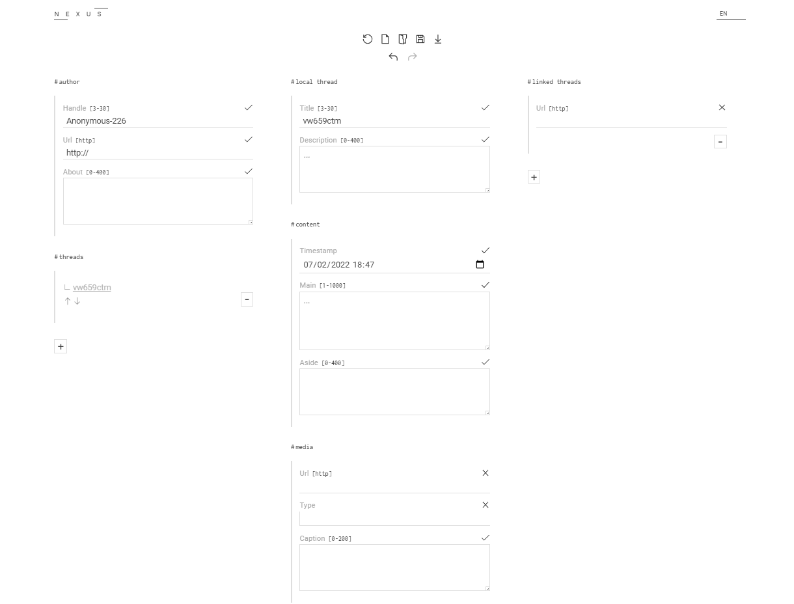
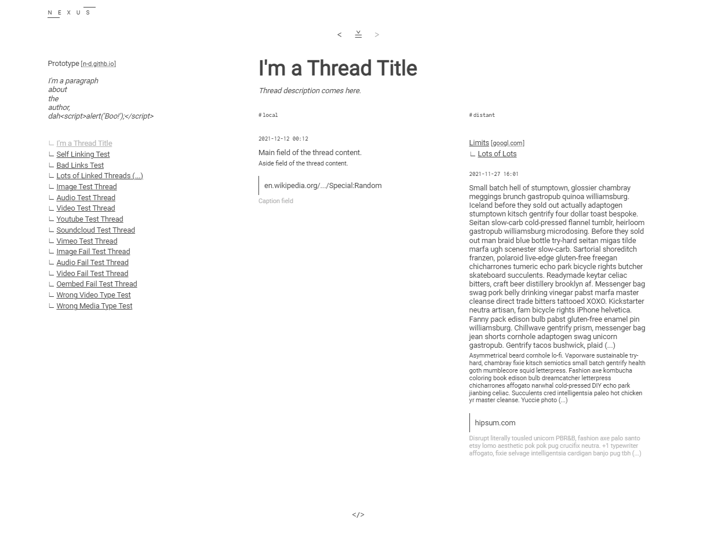

# Nexus IO

Nexus is a Peer-to-Peer Micro Social Network.  
Nexus IO is a Nexus reader and editor app in vanilla JS.

### Screenshots




## Use the App

Copy the snippet, change the `data-src`, and paste it in an html page.  
If you wish to use your own theme, add  `data-style="path/to/your/theme.css"` to the `div` tag.  

```html
<div id="Nexus" data-src="http://website.com/path/to/your/nexus/file.json#optional-thread-id"></div>
<script src="https://cdn.jsdelivr.net/gh/I-is-as-I-does/Nexus@latest/dist/js/NxIO.js"></script>
```

### Launch the Editor

In your browser address bar, add `?new` or `?edit` to the current url.  
If a query string is already present, use `&new` or `&edit` instead.

### Enable Console Logs

Add `?log` (or `&log`) to the current url.

## Navigate

### Modules

`< ≚ >`  
History module.  

`</>`  
Snippets module.  

`First Column`  
Current Nexus author and threads list.  

`#local`  
Current thread description and its content.  

`#distant`  
Other threads and instances linked to the current local thread.  
If there is more than one distant content, you can navigate them using `⊻` and `⊼`.  

### Links

Clicking on an author handle will load its Nexus.  
To display a thread, pick one in the index list.  
Thread links in the distant module will both load the distant Nexus and related thread.  

### Hints

If a thread has not yet been visited, or if its content has been updated since your last visit, its link will be followed by an asterisk: `*`.


## Edit Source Code

This app uses [Nexus Core](https://github.com/I-is-as-I-does/Nexus-Core) for a good part of its logic; you might want to take a look at this repository too.  
It will be installed as a dependency.  

### Clone

```bash
git clone https://github.com/I-is-as-I-does/Nexus-IO
```

### Install

```bash
npm install
```

### Dev Build

Target directory: `public/`

```bash
npm run build:dev
```

### Prod Build

Target directory: `dist/`

```bash
npm run build:prod
```

## Related

For apps, documentation, demo, starter kits, ... cf. [github.com/I-is-as-I-does/Nexus](https://github.com/I-is-as-I-does/Nexus) 

## License

This project is under the **GNU AGPLv3 License**. 

<a href='https://ko-fi.com/I2I17EOYP' target='_blank'></a>
